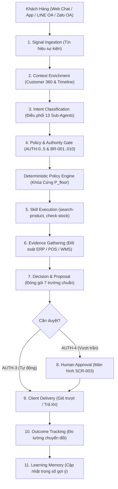

# Kiến Trúc Hệ Thống & Bộ Điều Phối Trung Tâm (Enterprise Core Architecture)

> **Thuộc hồ sơ:** `AI-REV-SRS-001` · **Phân hệ:** Platform Architecture  
> **Nguyên tắc thiết kế:** Zero-Disruption · **Mô hình điều phối:** Revenue Orchestrator 11 Bước  
> **Giao diện quản trị:** Human Command Center 5 Màn hình (SCR-001..005)

---

## 1. Ranh Giới Hệ Thống & Nguyên Tắc Zero-Disruption

Hệ thống AI Agent Doanh thu & CSKH được thiết kế dưới dạng **Bộ 3 Phân hệ Plug-and-Play (Marketing - Sales - CSKH)** ghép nối trực tiếp vào hạ tầng bán lẻ sẵn có của doanh nghiệp tại Đài Loan:

```text
┌────────────────────────────────────────────────────────────────────────┐
│ KÊNH TƯƠNG TÁC NGOẠI VI (OMNICHANNEL CONNECTORS)                       │
│ Web Chat Widget · Mobile App SDK · LINE Official Account · Zalo OA     │
└───────────────────────────────────┬────────────────────────────────────┘
                                    │ Webhook / WebSocket / REST
┌───────────────────────────────────▼────────────────────────────────────┐
│ LÕI ĐIỀU PHỐI TRUNG TÂM (ENTERPRISE REVENUE ORCHESTRATOR)              │
│ - 11 Bước xử lý tuần tự (Signal ➔ Decision ➔ Evidence ➔ Outcome)      │
│ - Điều phối 13 Sub-Agents chuyên trách (MKT-01..06, SAL-01..05, CS)    │
│ - Cổng kiểm soát thẩm quyền 6 cấp (AUTH-0..5) & 10 Quy tắc BR-001..010 │
│ - Deterministic Policy Engine: Máy chủ kiểm tra điều kiện P >= P_floor │
└─────────────────┬──────────────────────────────────┬───────────────────┘
                  │                                  │
┌─────────────────▼──────────────────┐ ┌─────────────▼───────────────────┐
│ DỮ LIỆU & BỘ NHỚ AI (SECOND BRAIN) │ │ COMMAND CENTER 5 MÀN HÌNH       │
│ - Customer 360 Ingestion Layer     │ │ - SCR-001: Executive Dashboard  │
│ - Two-Stage RAG & Vector DB        │ │ - SCR-002: Agent Operations     │
│ - 5 Tầng AI Memory (Working..Learn)│ │ - SCR-003: Approval Center      │
│ - Knowledge Base 5 Ngành hàng      │ │ - SCR-004: Customer 360 Console │
└─────────────────┬──────────────────┘ │ - SCR-005: Live Takeover (<1.0s)│
                  │                    └─────────────────────────────────┘
                  │ API Adapters (Read / Write có kiểm soát)
┌─────────────────▼──────────────────────────────────────────────────────┐
│ SYSTEM OF RECORD DUY NHẤT (HẠ TẦNG HIỆN HỮU CỦA DOANH NGHIỆP)          │
│ ERP Doanh nghiệp · POS Bán hàng · Kho WMS · Cổng Logistics Bưu cục CVS │
└────────────────────────────────────────────────────────────────────────┘
```

### Nguyên tắc Zero-Disruption cốt lõi:
1. **ERP / POS là nguồn sự thật duy nhất (Single Source of Truth):** AI không bao giờ tạo cơ sở dữ liệu giao dịch song song. Mọi thông tin về giá, tồn kho, đơn hàng và khách hàng đều được đọc và ghi trực tiếp vào ERP/POS.
2. **Fail-Closed (NFR-008):** Khi mất kết nối API với ERP/WMS hoặc đối tác bưu cục, hệ thống lập tức từ chối đưa ra khẳng định về giá hoặc tồn kho, chuyển hướng an toàn về hàng đợi nhân sự xử lý.

---

## 2. Quy Trình Điều Phối 11 Bước Của Revenue Orchestrator

Mọi tương tác từ khách hàng hoặc sự kiện hệ thống đều được điều phối tập trung qua chu trình 11 bước chuẩn:

```text
[1. SIGNAL] ──► [2. CONTEXT ENRICHMENT] ──► [3. INTENT CLASSIFICATION]
                                                      │
[6. EVIDENCE GATHERING] ◄── [5. SKILL EXECUTION] ◄── [4. POLICY & AUTH GATE]
        │
        ▼
[7. DECISION & PROPOSAL] ──► [8. HUMAN-IN-THE-LOOP (nếu AUTH-4)] ──► [9. CLIENT DELIVERY]
                                                                            │
[11. LEARNING MEMORY] ◄──────────────── [10. OUTCOME TRACKING] ◄────────────┘
```



1. **SIGNAL:** Tiếp nhận tín hiệu sự kiện (tin nhắn chat, mở trang, giỏ hàng bỏ quên, sự kiện ngày lương mùng 10).
2. **CONTEXT ENRICHMENT:** Truy vấn Customer 360 lấy lịch sử mua hàng, thiết bị tương thích, consent và điểm tín nhiệm.
3. **INTENT CLASSIFICATION:** Phân loại ý định của khách, gán nhãn mức độ ưu tiên và chuyển giao cho Sub-Agent phù hợp.
4. **POLICY & AUTH GATE:** Thẩm định quyền hạn (AUTH-0..5) và kiểm tra 10 quy tắc nghiệp vụ (**BR-001..010**).
5. **SKILL EXECUTION:** Gọi các kỹ năng thực thi (`search-product`, `check-stock`, `check-price`) với Idempotency Key.
6. **EVIDENCE GATHERING:** Thu thập bằng chứng đối soát xác thực (bảng giá ERP, tồn kho WMS, chính sách bảo hành).
7. **DECISION & PROPOSAL:** Sinh đề xuất bán hàng hoặc lời tư vấn đóng gói đầy đủ 7 trường thông tin bắt buộc.
8. **HUMAN-IN-THE-LOOP:** Nếu hành động vượt trần ngân sách hoặc yêu cầu thẩm quyền AUTH-4 $\rightarrow$ chuyển hàng đợi phê duyệt.
9. **CLIENT DELIVERY:** Xuất bản thông điệp đến giao diện người dùng (Web chat widget, LINE OA, SMS).
10. **OUTCOME TRACKING:** Đo lường phản hồi thực tế (khách bấm mua, từ chối, bỏ giỏ hoặc đánh giá hài lòng).
11. **LEARNING MEMORY:** Ghi nhận kết quả vào bộ nhớ học tập để cải tiến trọng số gợi ý cho các phiên tiếp theo.

---

## 3. Hệ Thống 5 Màn Hình Human Command Center (SCR-001..SCR-005)

Theo Mục 18 của SRS v0.1, hệ thống cung cấp bảng điều khiển quản trị tập trung dành cho đội ngũ vận hành nội bộ:

### SCR-001: Executive Revenue Dashboard (Bảng Điều Hành Doanh Thu)
* Hiển thị chỉ số doanh thu thời gian thực do AI đóng góp (AI-Attributed Revenue).
* Tỷ lệ chuyển đổi đơn hàng qua AI (Lead-to-Order Conversion Rate).
* Doanh thu bán chéo/bán thêm (Upsell/Cross-sell Revenue).
* Chi phí vận hành AI (FinOps Token Cost) và tỷ suất hoàn vốn đầu tư (ROI).

### SCR-002: Agent Operations Center (Trung Tâm Vận Hành Bot)
* Giám sát trạng thái hoạt động của 13 Sub-Agents theo thời gian thực.
* Đo lường độ trễ phản hồi (Response Latency P95, P99), lưu lượng xử lý (Throughput RPM).
* Tỷ lệ lỗi (Error Rate) và cảnh báo ngắt kết nối với các cổng API ngoại vi.

### SCR-003: Campaign & Subsidy Approval Center (Trung Tâm Duyệt Chiến Dịch & Trợ Cấp)
* Hàng đợi phê duyệt các hành động thuộc thẩm quyền **AUTH-4**:
  * Các chiến dịch Marketing gửi tin nhắn hàng loạt có ngân sách vượt ngưỡng quy định.
  * Các trường hợp đề xuất giảm giá đặc biệt hoặc giải quyết đền bù khiếu nại vượt hạn mức tự động.

### SCR-004: Customer 360 & Memory Explorer (Khám Phá Hồ Sơ & Bộ Nhớ Khách Hàng)
* Tra cứu chi tiết hồ sơ khách hàng: lịch sử mua sắm ERP, dòng thời gian tương tác (Timeline), điểm tín nhiệm (Trust Score), trạng thái đồng thuận tiếp thị (Consent Status).
* Kiểm tra dữ liệu bộ nhớ ngữ cảnh và sở thích đã được xác thực của khách hàng.

### SCR-005: Conversation Console & Human Takeover (Giám Sát Hội Thoại & Tiếp Quản Khẩn Cấp)
* Cho phép nhân viên hỗ trợ giám sát các cuộc hội thoại trực tiếp đang diễn ra giữa AI và khách hàng.
* Nút bấm **Tiếp quản khẩn cấp (Human Takeover)** với độ trễ chuyển giao dưới **1.0 giây**, tự động ngắt bot và bàn giao toàn bộ ngữ cảnh hội thoại cho nhân sự phụ trách.

---

## 4. Ma Trận Quản Trị Rủi Ro & Kế Hoạch Ứng Phó (Risk Mitigation & Fallback Matrix)

Hệ thống thiết lập cơ chế phòng vệ chủ động đối với 5 kịch bản rủi ro vận hành thực tế tại Đài Loan:

| Mã Rủi Ro | Tình Huống Sự Cố Thực Tế | Mức Độ | Cơ Chế Tự Động Phòng Vệ & Fallback của Hệ Thống |
|---|---|:---:|---|
| **RSK-01** | **API ERP / POS / WMS bị mất kết nối hoặc timeout > 3.0s** | Nghiêm trọng | **Kích hoạt Fail-Closed (NFR-008):** Dừng toàn bộ luồng tạo đơn và báo giá; bot phát thông báo hệ thống đang bảo trì dữ liệu; ghi nhận thông tin khách và đẩy vào hàng đợi nhân viên hỗ trợ xử lý sau khi kết nối phục hồi. |
| **RSK-02** | **Lệnh nghỉ bão lũ Đài Loan (Typhoon Day 停班停課) làm tê liệt bưu cục CVS** | Trung bình | **Lắng nghe Webhook đối tác vận chuyển:** Khi có thông báo hoãn giao từ 4 chuỗi bưu cục, hệ thống tự động lọc danh sách đơn hàng bị ảnh hưởng; gửi tin nhắn Zalo/LINE chủ động giải trình và trấn an khách trước khi khách lo lắng. |
| **RSK-03** | **Tấn công Prompt Injection / Jailbreak bot ép giá hoặc hack giá 0 đồng** | Cao | **Deterministic Policy Engine ngoài LLM:** Mọi giao dịch bắt buộc qua code cứng kiểm tra $P_{offered} \ge P_{floor}$. Lớp code cứng tự động từ chối và ghi log cảnh báo an ninh bảo mật (**BR-002**, **BR-009**), LLM không thể can thiệp. |
| **RSK-04** | **Khách không nhận hàng tại siêu thị dẫn đến bưu phẩm hoàn trả (未取貨)** | Trung bình | **Cơ chế chế tài vi phạm:** Hệ thống C360 tự động ghi cờ Delivery Default, hạ điểm tín nhiệm Trust Score, tạm khóa phương thức thanh toán CVS COD và tước quyền mặc cả trợ cấp giá trong 90–180 ngày tiếp theo. |
| **RSK-05** | **Khách hàng bức xúc gay gắt, chửi bới hoặc đòi khiếu nại pháp lý** | Cao | **Báo động đỏ Crisis Alert:** Ngắt quyền trả lời của bot ngay lập tức (<0.2s); phát cảnh báo khẩn cấp Telegram Bot cho Quản lý CSKH (<2 phút); nhân sự bấm tiếp quản trên màn hình SCR-005 trong vòng $\le 1.0\text{s}$. |

