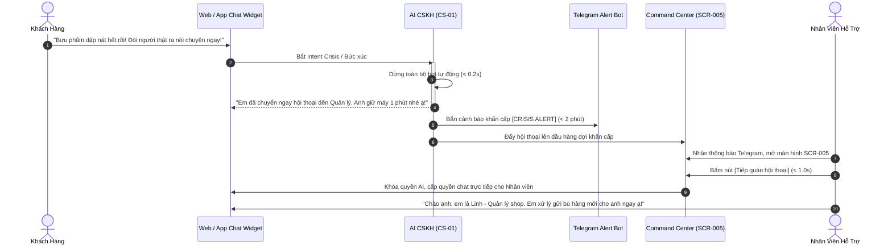
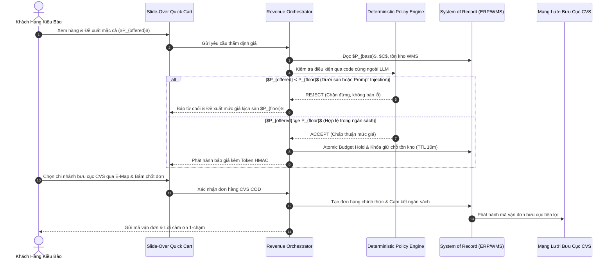

# Luồng Vận Hành, Thẩm Quyền AUTH-0..5 & 10 Quy Tắc Nghiệp Vụ (Workflows & Governance)

> **Thuộc hồ sơ:** `AI-REV-SRS-001` · **Phân hệ:** Governance & Orchestration  
> **Thẩm quyền:** 6 Cấp độ (AUTH-0 đến AUTH-5)  
> **Quy tắc bất biến:** 10 Business Rules (BR-001..BR-010)

---

## 1. Ma Trận Phân Quyền Thẩm Quyền 6 Cấp (Authority Matrix AUTH-0..5)

Mọi hành động của 13 Sub-Agents đều bị kiểm soát nghiêm ngặt qua cổng thẩm quyền tại Revenue Orchestrator:

| Cấp Thẩm Quyền | Định Nghĩa & Quyền Hạn | Phạm Vi Hành Động Được Phép Của AI | Ví Dụ Điển Hình |
|---|---|---|---|
| **AUTH-0** | **Observe (Chỉ quan sát)** | Chỉ đọc dữ liệu từ System of Record (ERP/WMS/C360), ghi log audit; không sinh nội dung tới khách | Đọc tồn kho WMS, tra cứu lịch sử mua hàng, đếm ngày nạp SIM |
| **AUTH-1** | **Recommend (Đề xuất)** | Sinh đề xuất kèm đầy đủ lý do (Reason), bằng chứng (Evidence) và độ tin cậy; không tự thực thi | Gợi ý 2 sản phẩm thay thế khi hết hàng, đề xuất chiến dịch MKT |
| **AUTH-2** | **Draft (Soạn thảo)** | Tạo bản thảo nội dung, tạo giỏ hàng nháp hoặc báo giá chờ người duyệt | Soạn nội dung tin nhắn quảng cáo mùng 10, soạn kịch bản CSKH |
| **AUTH-3** | **Bounded Execute (Tự thực thi trong hạn mức)** | Tự động thực thi hành động nếu nằm trong hạn mức ngân sách và quy tắc chính sách đã phê duyệt trước | Trả lời câu hỏi FAQ, gửi tin nhắc giỏ hàng bỏ quên, tạo đơn hàng CVS COD đúng giá |
| **AUTH-4** | **Human Approve (Bắt buộc người duyệt)** | AI chỉ được lập đề xuất, bắt buộc nhân sự có thẩm quyền bấm duyệt trên màn hình SCR-003 trước khi phát lệnh | Phát động chiến dịch gửi tin nhắn hàng loạt, xử lý bồi thường khiếu nại vượt trần |
| **AUTH-5** | **Blocked (Cấm tuyệt đối)** | Hành động bị hệ thống chốt chặn từ chối tự động (Fail-Closed); ghi nhận cảnh báo vi phạm bảo mật | Bán dưới giá sàn $P_{floor}$, tiết lộ giá vốn nội bộ, tự sửa đổi quyền hạn tài khoản |

---

## 2. Hệ Thống 10 Quy Tắc Nghiệp Vụ Bất Biến (BR-001..BR-010)

Theo Mục 15 của SRS v0.1, toàn bộ hệ thống phải tuân thủ nghiêm ngặt 10 quy tắc:

* **BR-001 (Price Grounding):** Toàn bộ giá bán, biểu phí giao hàng và chính sách khuyến mãi bắt buộc đọc từ ERP/POS. AI tuyệt đối không tự bịa đặt hoặc tự cấp giá.
* **BR-002 (Client Tampering Defense):** Nghiêm cấm nhận giá, mã giảm giá hoặc tiền tệ truyền lên từ phía trình duyệt client. Mọi giao dịch đều phải qua bộ tính toán phía máy chủ.
* **BR-003 (Zero Hallucination on Specs):** Không suy đoán hoặc bịa đặt thông số kỹ thuật sản phẩm, thời lượng pin, tốc độ tối đa hay công dụng y tế ngoài tài liệu đã kiểm duyệt.
* **BR-004 (Consent & Suppression Compliance):** Tuân thủ Đạo luật Bảo vệ Dữ liệu Cá nhân (Taiwan PDPA). Chỉ gửi tin khi khách có đồng thuận; chặn gửi tin nếu khách đã từ chối hoặc nằm trong danh sách hạn chế (Suppression List).
* **BR-005 (Unique Execution ID):** Một action có tác động bên ngoài bắt buộc phải có Unique Execution ID (`idempotency_key`) để chống trùng lặp thao tác khi mạng lag.
* **BR-006 (Idempotent Retry):** Retry không được tạo hành động trùng lặp (cơ chế thử lại khi mất mạng tuyệt đối không sinh 2 đơn hàng hoặc gửi 2 tin nhắn lặp lại cho khách).
* **BR-007 (High-Risk & Financial Approval):** Hành động tài chính hoặc rủi ro cao bắt buộc phải qua phê duyệt (Human Approval) của nhân sự quản lý trên màn hình SCR-003.
* **BR-008 (Authority Boundary Enforcement):** Agent không được vượt quyền kể cả khi LLM yêu cầu (tuân thủ nghiêm ngặt ma trận thẩm quyền AUTH-0..5).
* **BR-009 (No Privilege Escalation via User Prompt):** Prompt hoặc nội dung do khách hàng cung cấp không thể tự nâng quyền Agent hay thay đổi chính sách bảo vệ giá sàn $P_{floor}$.
* **BR-010 (Evidence Generation & Audit Trail):** Mọi execution quan trọng bắt buộc phải sinh evidence đối soát và lưu vết kiểm toán bất biến.

---

## 3. Cơ Chế Chuyển Giao Người Thật Tức Thì (Human Takeover ≤ 1.0s)

```text
[Khách giận dữ / Khiếu nại / Đòi gặp người thật]
                     │
                     ▼
┌────────────────────────────────────────────────────────┐
│ BƯỚC 1: DỪNG BOT NGAY LẬP TỨC (< 0.2 giây)             │
│ - Ngắt toàn bộ kịch bản tự động                        │
│ - Xuất thông điệp xoa dịu trung thực                   │
└────────────────────┬───────────────────────────────────┘
                     │
                     ▼
┌────────────────────────────────────────────────────────┐
│ BƯỚC 2: BẮN CẢNH BÁO KHẨN CRISIS ALERT (< 2 phút)      │
│ - Gửi thông báo Telegram Bot tới nhóm quản lý          │
│ - Đẩy hội thoại lên đầu danh sách khẩn cấp SCR-005     │
└────────────────────┬───────────────────────────────────┘
                     │
                     ▼
┌────────────────────────────────────────────────────────┐
│ BƯỚC 3: NHÂN SỰ TIẾP QUẢN TRỰC TIẾP (< 1.0 giây)       │
│ - Nhân viên bấm [Tiếp quản hội thoại] trên SCR-005     │
│ - Đọc bản tóm tắt 3 dòng về nguyên nhân và đơn hàng    │
│ - Trò chuyện trực tiếp với khách mà không bắt lặp lại  │
└────────────────────────────────────────────────────────┘
```



---

## 4. Sơ Đồ Trình Tự Bán Hàng Đầu Cuối (End-to-End Lead-to-Cash Sequence)


